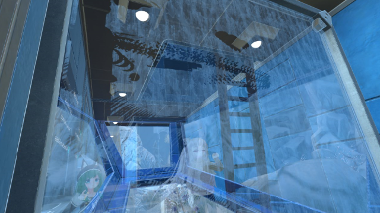

# VRCSmokeGlass Standard Edition

---

## Detail

VRChat上で動作する曇りガラスを再現するシェーダと、
それを表示するためのセットアップ済みマテリアルやprefabを実装したものです。

この機構により、曇っているガラスに触れ、曇りを消すことができ、
そして徐々に曇った状態に戻っていくといったギミックを作る事が出来ます。

使い方、セットアップ方法は
[オンラインドキュメント](https://azuritelab.github.io/VRCSmokeGlassDocs/)
を参照してください。

## BOOTH Edition

BOOTHで開発支援を行っていただいた方は色々な曇り方のテクスチャやノーマルマップを
設定済みのprefabを追加で6つつけています（こちらはデフォルトのStandardとUnlit版の二つのみです）。

https://atl.booth.pm/items/1695952